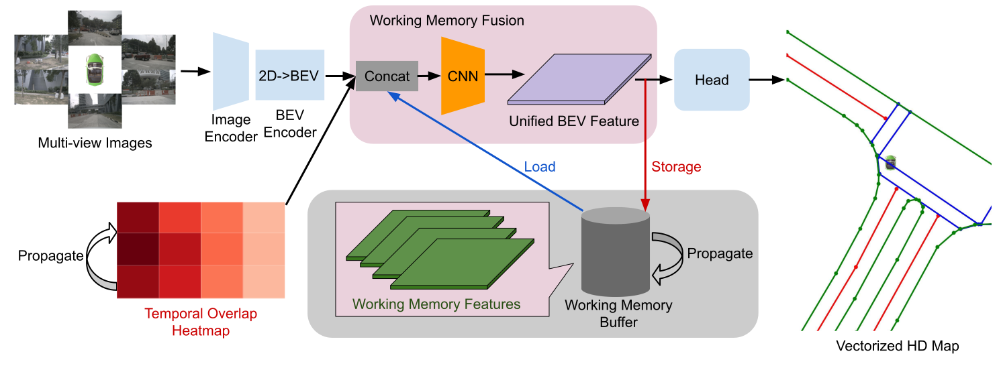

<div align="center">
  <h1>MemFusionMap</h1>
  
  <h3>[WACV 2025] MemFusionMap: Working Memory Fusion for Online Vectorized HD Map Construction </h3>
  
  [](https://arxiv.org/abs/2409.18737)
  [](https://song-jingyu.github.io/MemFusionMap/)

  
</div>

## News
- **[2025-03]** The code for MemFusionMap is available!
- **[2024-11]** The preprint of the camera-ready paper is available on [arXiv](https://arxiv.org/abs/2409.18737).
- **[2024-10]** MemFusionMap is accepted by WACV 2025.

## Abstract
High-definition (HD) maps provide environmental information for autonomous driving systems and are essential for safe planning. While existing methods with single-frame input achieve impressive performance for online vectorized HD map construction, they still struggle with complex scenarios and occlusions. We propose MemFusionMap, a novel temporal fusion model with enhanced temporal reasoning capabilities for online HD map construction. Specifically, we contribute a working memory fusion module that improves the model's memory capacity to reason across a history of frames. We also design a novel temporal overlap heatmap to explicitly inform the model about the temporal overlap information and vehicle trajectory in the Bird's Eye View space. By integrating these two designs, MemFusionMap significantly outperforms existing methods while also maintaining a versatile design for scalability. We conduct extensive evaluation on open-source benchmarks and demonstrate a maximum improvement of 5.4% in mAP over state-of-the-art methods.

## Getting Started
We implement MemFusionMap based on the open-source codebase of [StreamMapNet](https://github.com/yuantianyuan01/StreamMapNet) and [MMDetection3D](https://github.com/open-mmlab/mmdetection3d). We borrow the guide of getting started from StreamMapNet and provide the detailed steps below. Please follow the guideline to install the environment and prepare the data.

### 1. Environment
**Step 1.** Create conda environment and activate it.

```
conda create --name memfusionmap python=3.8 -y
conda activate memfusionmap
```

**Step 2.** Install PyTorch.

```
pip install torch==1.9.0+cu111 torchvision==0.10.0+cu111 torchaudio==0.9.0 -f https://download.pytorch.org/whl/torch_stable.html
```

**Step 3.** Install MMCV series.

```
# Install mmcv-series
pip install mmcv-full==1.6.0
pip install mmdet==2.28.2
pip install mmsegmentation==0.30.0
git clone https://github.com/open-mmlab/mmdetection3d.git
cd mmdetection3d
git checkout v1.0.0rc6 
pip install -e .
```

**Step 4.** Install other requirements.

```
pip install -r requirements.txt
```

### 2. Data Preparation
**Step 1.** Download [nuScenes](https://www.nuscenes.org/download) dataset to `./datasets/nuScenes`.

**Step 2.** Download [Argoverse2 (sensor)](https://argoverse.github.io/user-guide/getting_started.html#download-the-datasets) dataset to `./datasets/av2`.

**Step 3.** Generate annotation files for NuScenes dataset.

```
python tools/nuscenes_converter.py --data-root ./datasets/nuScenes --newsplit
```

**Step 4.** Generate annotation files for Argoverse2 dataset.

```
python tools/argoverse_converter.py --data-root ./datasets/av2 --newsplit
```

### 3. Training and Validating
Before training and validating, you need to modify the `data_root` and `pkl_root` in the configuration file. For example, you can modify the `data_root` to `./datasets/nuScenes` and `pkl_root` to `./datasets/nuScenes/annotations`.

To train a model with 8 GPUs:

```
bash tools/dist_train.sh ${CONFIG} 8
```

To validate a model with 8 GPUs:

```
bash tools/dist_test.sh ${CONFIG} ${CEHCKPOINT} 8 --eval
```

To test a model's inference speed:

```
python tools/benchmark.py ${CONFIG} ${CEHCKPOINT}
```

## Results

### Results on nuScenes newsplit
| Range            | $\mathrm{AP}_{ped}$ | $\mathrm{AP}_{div}$ | $\mathrm{AP}_{bound}$ | $\mathrm{AP}$ | Config                                                      | Epoch | Checkpoint                                                                                              |
|:----------------:|:-------------------:|:-------------------:|:---------------------:|:------------:|:------------------------------------------------------------:|:-----:|:--------------------------------------------------------------------------------------------------------:|
| $60\times 30\ m$ | 38.3               | 32.1               | 43.6                 | 38.0         | [Config](./plugin/configs/memfusionmap_nusc_newsplit_480_60x30_24e.py)    | 24    | [ckpt](https://drive.google.com/file/d/1fYPzpkbo_QNsHAA_j2SBhZ0DMFoE2Vly/view?usp=sharing)            |
| $100\times 50\ m$| 30.2               | 22.6               | 29.9                 | 27.6         | [Config](./plugin/configs/memfusionmap_nusc_newsplit_480_100x50_24e.py)   | 24    | [ckpt](https://drive.google.com/file/d/1pGnt4H4Bz3CBlpg02krI11qXInityUUy/view?usp=sharing)            |

### Results on Argoverse2 newsplit
| Range            | $\mathrm{AP}_{ped}$ | $\mathrm{AP}_{div}$ | $\mathrm{AP}_{bound}$ | $\mathrm{AP}$ | Config                                                     | Epoch | Checkpoint                                                                                             |
|:----------------:|:-------------------:|:-------------------:|:---------------------:|:------------:|:----------------------------------------------------------:|:-----:|:-------------------------------------------------------------------------------------------------------:|
| $60\times 30\ m$ | 59.3               | 57.2               | 65.1                 | 60.6         | [Config](./plugin/configs/memfusionmap_av2_newsplit_608_60x30_30e.py)   | 30    | [ckpt](https://drive.google.com/file/d/1HgS3kCWGAJDWlHV6df6JZ8c3f5_lLRbz/view?usp=sharing)           |
| $100\times 50\ m$| 64.1               | 47.3               | 51.5                 | 54.3         | [Config](./plugin/configs/memfusionmap_av2_newsplit_608_100x50_30e.py5)  | 30    | [ckpt](https://drive.google.com/file/d/1UQ7noNyOhSzfN4IDUxiOshNSZzNVrBgj/view?usp=sharing)           |

<!-- ### Results on NuScenes oldsplit
| Range | $\mathrm{AP}_{ped}$ | $\mathrm{AP}_{div}$| $\mathrm{AP}_{bound}$ | $\mathrm{AP}$ | Config | Epoch | Checkpoint |
| :---: |   :---:  |  :---:  | :---:      |:---:|:---:|:---:   | :---:      |
| $60\times 30\ m$ | 61.7| 66.3 | 62.1 | 63.4 | [Config](./plugin/configs/nusc_baseline_480_60x30_30e.py) | 30| [ckpt](https://drive.google.com/file/d/1-n6DGu23KkSO8PFfJ01ofmtUed0zOMZ_/view?usp=share_link)| -->

## Acknowledgement
MemFusionMap is greatly inspired by the open-source codebase of [StreamMapNet](https://github.com/yuantianyuan01/StreamMapNet). We would like to express our sincere gratitude to the authors for their contributions. We also thank the outstanding work of [MMDetection3D](https://github.com/open-mmlab/mmdetection3d), which is the foundation of MemFusionMap.

## Citation
If you find our paper or codebase useful in your research, please give us a star and cite our paper.
```
@InProceedings{song2025memfusionmap,
      author    = {Song, Jingyu and Chen, Xudong and Lu, Liupei and Li, Jie and Skinner, Katherine A.},
      title     = {MemFusionMap: Working Memory Fusion for Online Vectorized HD Map Construction},
      booktitle = {Proceedings of the Winter Conference on Applications of Computer Vision (WACV)},
      month     = {February},
      year      = {2025},
      pages     = {9230-9239}
    }
```
